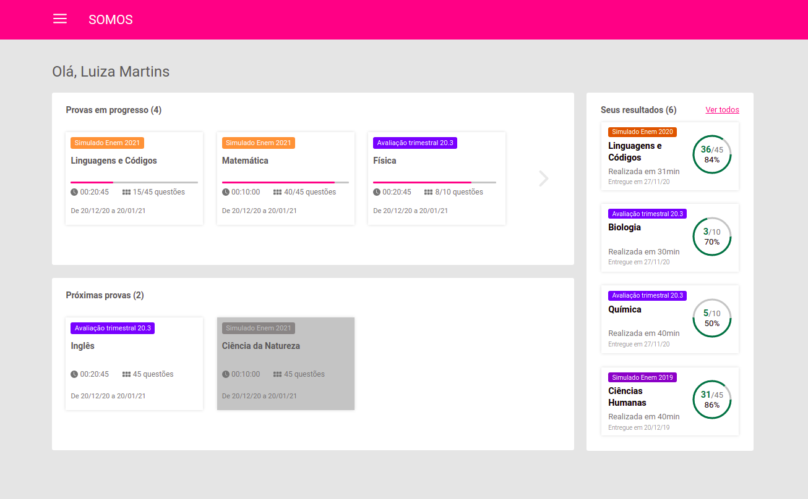
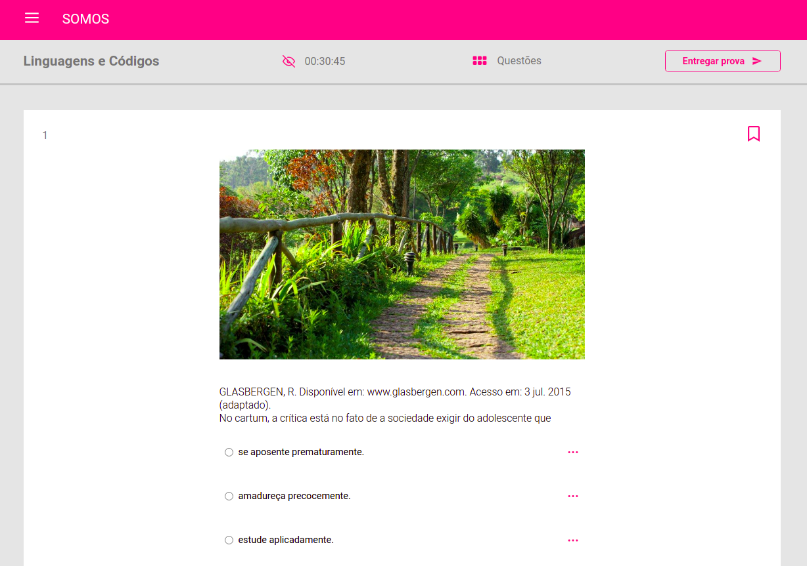
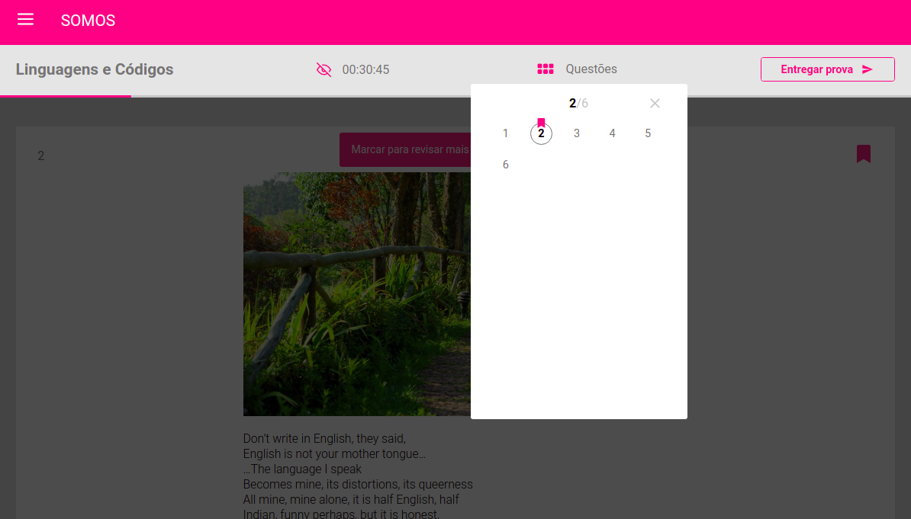

<h1 align="center">
 🚀 Teste Front-end Developer Meritt
</h1>

<p align="center">
  <a href="#%EF%B8%8F-about-the-project">About the project</a>&nbsp;&nbsp;&nbsp;|&nbsp;&nbsp;&nbsp;
  <a href="#-technologies">Technologies</a>&nbsp;&nbsp;&nbsp;|&nbsp;&nbsp;&nbsp;
  <a href="#-getting-started">Getting started</a>&nbsp;&nbsp;&nbsp;|&nbsp;&nbsp;&nbsp;
  <a href="#-license">License</a>
</p>

## 💇🏻‍♂️ About the project

This is a test for a Front-End  position at Meritt. 
this project is a study platform

## Layout

<div align="center">
 
 
 
</div>

## 🚀 Technologies

Technologies that I used to develop this web client

- [ReactJS](https://reactjs.org/)
- [TypeScript](https://www.typescriptlang.org/)
- [React Icons](https://react-icons.netlify.com/#/)
- [Styled Components](https://styled-components.com/)
- [Axios](https://github.com/axios/axios)
- [Eslint](https://eslint.org/)
- [Prettier](https://prettier.io/)
- [EditorConfig](https://editorconfig.org/)

## 💻 Getting started

### Requirements

**Clone the project and access the folder**

```bash
$ git clone git@github.com:mauriciogirardi/test-front-end-meritt.git
```

**Follow the steps below**

```bash
# Install the dependencies
$ yarn

# run json-server
npx  json-server server.json -p 3333 -w

# Start the client
$ yarn start
```

## 📝 License

This project is licensed under the MIT License - see the [LICENSE](LICENSE) file for details.

---

Made with 💜 by Mauricio Girardi 👋 [See my linkedin](https://www.linkedin.com/in/mauricio-girardi/)
